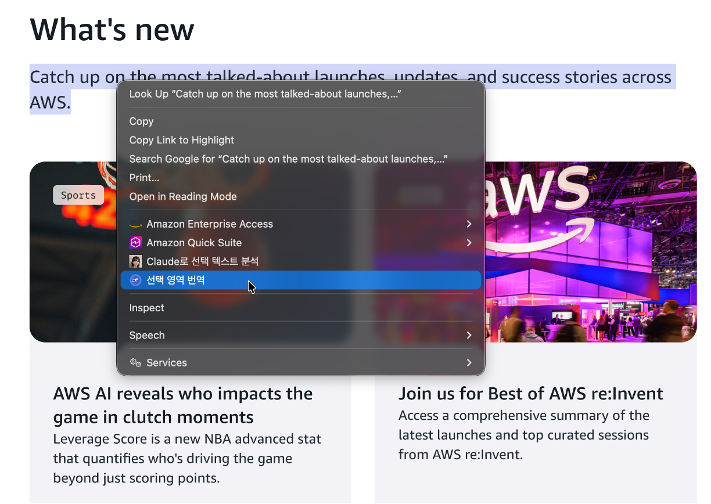
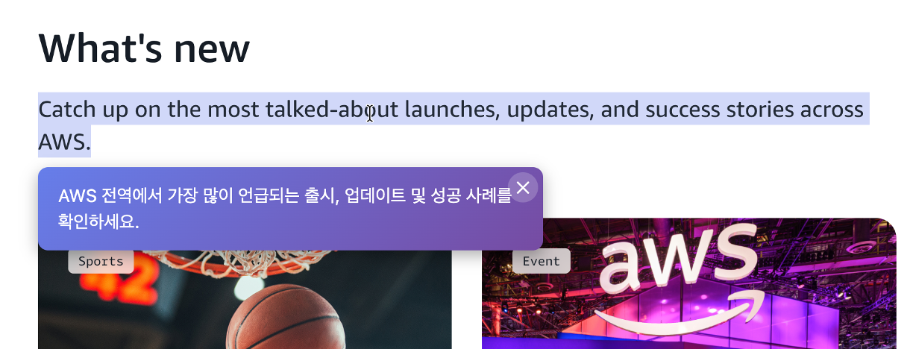
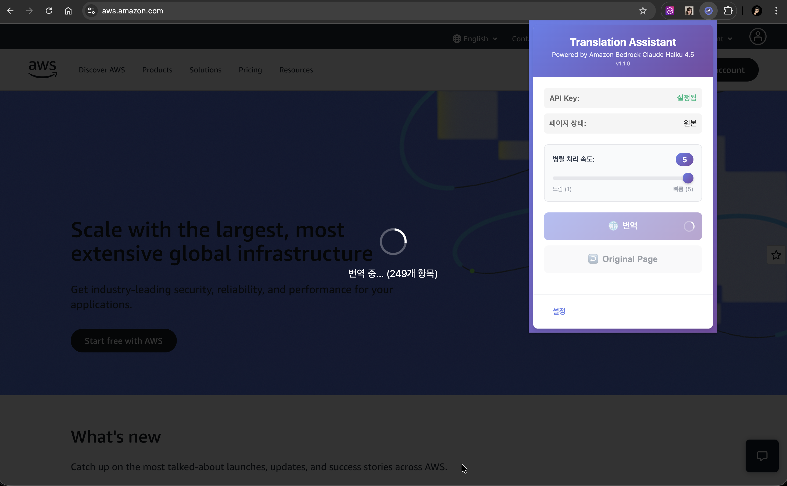

# AWS Translation Assistant Chrome Extension

Amazon Bedrock Claude Haiku 4.5 기반 웹페이지 번역 Chrome Extension

## 주요 기능

- **웹페이지 전체 번역**: 현재 페이지를 한글로 번역
- **선택 영역 번역**: 드래그한 텍스트만 빠르게 번역
- **원본 복원**: 클릭 한 번으로 원본 페이지로 복원
- **Amazon Bedrock 연동**: Claude Haiku 4.5 모델 사용
- **보안 정책 준수**: 회사 내부 노트북에서 웹페이지 번역 (Google Translate, Deepl 등이 허용되지 않는 환경)

## 기능 소개

### 1. 선택 영역 번역 - Context Menu

*텍스트 선택 후 오른쪽 클릭하면 "선택 영역 번역" 메뉴가 표시됨*

- 원하는 텍스트를 드래그로 선택
- 오른쪽 클릭하면 컨텍스트 메뉴에 "선택 영역 번역" 옵션 표시
- 빠르고 편리한 부분 번역

### 2. 선택 영역 번역 - 인라인 툴팁

*선택한 텍스트 바로 아래에 번역 결과가 툴팁으로 표시됨*

- AWS 보라색 그라데이션 디자인의 아름다운 툴팁
- 선택한 위치 바로 아래에 표시
- 외부 클릭 또는 닫기 버튼으로 닫기

### 3. 전체 페이지 번역 - 진행 중

*"번역" 버튼 클릭 시 진행 상태가 표시됨*

- 번역 진행 중 오버레이 표시
- 번역할 항목 수 표시 (예: 266개 항목)
- 백그라운드에서 Claude Haiku 4.5로 번역 수행

### 4. 전체 페이지 번역 - 완료

*웹 페이지가 한글로 번역된 모습*

- 원본 레이아웃 유지
- 모든 텍스트가 한국어로 번역됨
- "Original Page" 버튼으로 원본 복원 가능

## 기술 스택

- Chrome Extension Manifest V3
- Amazon Bedrock Runtime API
- Claude Haiku 4.5 (`global.anthropic.claude-haiku-4-5-20251001-v1:0`)
- AWS SDK for JavaScript v3

## 설치 방법

### 1. 저장소 클론
```bash
git clone https://github.com/jesamkim/chrome-trans.git
cd chrome-trans
```

### 2. 의존성 설치
```bash
npm install
```

### 3. Chrome Extension 로드
1. Chrome 브라우저에서 `chrome://extensions/` 이동
2. 우측 상단의 "개발자 모드" 활성화
3. "압축해제된 확장 프로그램을 로드합니다" 클릭
4. 프로젝트 폴더 선택

### 4. AWS 인증 설정
1. Extension 아이콘 클릭
2. 설정 페이지에서 발급받은 Amazon Bedrock API Key 입력

## 사용 방법

### 전체 페이지 번역
1. 번역하고 싶은 웹페이지에서 Extension 아이콘 클릭
2. "번역" 버튼 클릭
3. 페이지가 한글로 번역됨
4. "Original Page" 버튼으로 원본 복원

### 선택 영역 번역 (빠른 번역)
1. 웹 페이지에서 번역하고 싶은 텍스트를 드래그로 선택
2. 오른쪽 클릭
3. "선택 영역 번역" 메뉴 클릭
4. 선택한 위치 아래에 번역 결과가 툴팁으로 표시됨
5. 외부 클릭 또는 닫기 버튼(✕)으로 툴팁 닫기

## 프로젝트 구조

```
chrome-trans/
├── manifest.json           # Chrome Extension 매니페스트
├── package.json           # npm 설정
├── src/
│   ├── background/        # Service Worker
│   │   ├── background.js
│   │   ├── bedrock-client.js
│   │   └── translation-manager.js
│   ├── content/           # Content Scripts
│   │   ├── content.js
│   │   ├── dom-manager.js
│   │   └── content.css
│   ├── popup/             # 팝업 UI
│   │   ├── popup.html
│   │   ├── popup.css
│   │   └── popup.js
│   ├── options/           # 설정 페이지
│   │   ├── options.html
│   │   ├── options.css
│   │   └── options.js
│   └── assets/
│       └── icons/
└── tests/                 # 테스트
```

## 개발

### 테스트 실행
```bash
npm test
```

### 개발 모드
```bash
npm run dev
```

## 보안 고려사항

- API Key는 Chrome Storage Sync API에 안전하게 저장
- 모든 통신은 HTTPS를 통해 이루어짐
- 최소 권한 원칙 적용
- 민감한 페이지 번역 제외 옵션 제공

## 라이선스

MIT License

## 만든이

Jesam Kim (AWS SA)
